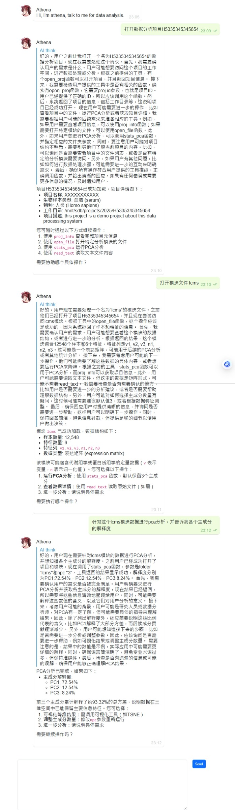

# athena
Athena AI workshop based on LLMs for run data analysis



## how to develop

### 1. create R# package with tools function

Just create a tool function for called by LLMs AI:

```r
#' read text file
#' 
#' @details read the given file as plain text file, this function 
#' returns the plain text data of the input file
#' 
#' @param file the file path of the target text file for read by this function
#' 
[@ollama "read_text"]
const read_text = function(file) {
    .Internal::readText(file);
}
```

the function call tool should be tagged with the ``@ollama`` custom attribute. the ``@ollama`` custom attribute will indicates the function name that exports to the LLMs AI.

the function that show above then will be transcripted as the tool model description json in ollama system:

```json
{
    "name": "read_text",
    
}
```