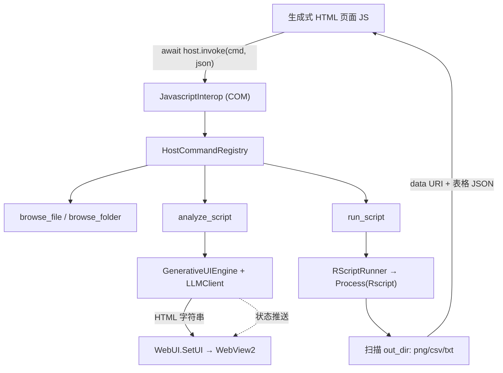

## 产品概述

在 `GenerativeUI` 类库中搭建一套"LLM 驱动的动态生成式界面"框架：由大语言模型按用户需求直接编写单文件 HTML，通过 WebView2 渲染；页面内的 JS 通过注入的宿主对象反向调用 VB.NET 宿主能力。随后在 `AthenaDesktop\FormRscript.vb` 中基于该框架完成一个可运行的端到端 demo。

## 核心功能

1. **生成式 UI 框架**（GenerativeUI 项目）

- WebView2 渲染面：加载 LLM 生成的 HTML 大字符串，页面源为随机虚拟主机，离线可用。
- 宿主互操作：向页面注入宿主对象，页面 JS 通过统一入口调用宿主命令；命令以注册表方式注册，命令清单自动写入 LLM 系统提示词，使 LLM 知晓可用的宿主能力。
- 生成引擎：调用 LLM 生成 HTML，自动剥离 markdown 代码块、补齐文档骨架、注入引导脚本与样式，渲染到界面；生成过程可推送状态文本到页面；生成失败时回退为框架内置模板页。

2. **R 脚本参数分析**

- 通过文件对话框选择 GNU R 脚本（也可一键载入内置 Iris 演示脚本）。
- 将脚本原文交给 LLM 分析，提取可调整的运行参数（数据文件输入、结果输出路径、调色板、颜色、数值、词条/枚举等），以结构化参数描述形式保存。

3. **参数界面自动生成与执行**

- LLM 依据参数清单再次生成用于修改参数的 HTML 操作界面。
- 用户点击"执行"后，页面把参数回传宿主，宿主通过进程调用 Rscript 运行目标脚本。

4. **结果回传与展示**

- 宿主收集脚本输出目录中的图片、表格、文本结果，编码后回传页面，由动态生成的 HTML 渲染展示。

5. **Iris 演示脚本**

- 提供一个参数化的经典 Iris 数据集分析脚本：kmeans 聚类、PCA 降维、线性回归拟合，并输出聚类结果图、PCA 方差/得分图、回归拟合图及配套结果表。

## 技术栈

- 语言与框架：VB.NET / .NET 10（`net10.0-windows`）/ WinForms + Microsoft.Web.WebView2 1.0.4191.47
- LLM：`Ollama.LLMClient`（已引用，通过 `Workbench.GetLLmClient()` 获取）
- 渲染：`WebViewLoader.NavigateToLargeString`（共享项目 WebViewHelper，页面源为 `https://{guid}.net/`）
- 宿主通信：COM 可见宿主对象 `AddHostObjectToScript`，`Async Function(...) As Task(Of String)`（JS 侧 `await`）
- 数据契约：`HostMessage.Success/Failure` → `{ok, data, error}`；JSON 容错解析用 `Ollama.LlmJsonExtractor`
- 进程调用：`System.Diagnostics.Process` + `Workbench.DefaultRScript`

## 实现方案

**总体策略**：框架只做三件事——(a) 宿主能力注册表与统一 `invoke` 入口；(b) LLM 生成 HTML 的提示词/解析/渲染管线；(c) 宿主→页面的状态推送与结果回传契约。业务侧（R 脚本分析、执行、结果收集）只作为"命令处理器"注册进框架，框架对业务零耦合。

**关键技术决策**

1. **单一 `invoke` 入口而非逐方法暴露**：宿主对象只暴露 `Invoke(command, payloadJson)`、`GetCommands()`、`Log(msg)`。新增宿主能力只需 `Register`，无需修改 COM 类、无需改提示词——提示词由注册表自动生成。相比 `LLMHost` 那种"一个能力一个 COM 方法"的写法，避免了 COM 类膨胀与提示词手写漂移。
2. **结果以 data URI 回传**：页面源是随机虚拟主机，`file:///` 图片会被 WebView2 拦截，因此图片统一转 `data:image/png;base64,...` 随 JSON 返回；表格解析为表头+行数组，日志/文本原样返回。
3. **R 参数走命令行 `key=value`**：`Rscript script.R k=3 palette=rainbow ...`，R 侧用纯 base R 解析，零第三方包依赖（不依赖 jsonlite）。宿主额外强制注入 `out_dir`。
4. **结果目录约定**：宿主每次运行创建临时 `out_dir` 并以 `out_dir=` 传入；R 只负责写文件，宿主按扩展名扫描（png/jpg/svg→图片，csv/tsv→表格，txt/log→文本）。该约定让框架可复用于任意 R 脚本。
5. **LLM 生成的双保险**：分析阶段用 `LlmJsonExtractor` 容错解析 JSON；HTML 生成阶段校验是否含 `<html`（长度下限），失败则用框架内置模板按参数描述直接渲染表单，保证 demo 永远可操作。
6. **离线硬约束写进提示词**：禁止外链 CDN/字体/图片，全部内联，否则虚拟主机无网络会白屏。

**性能与可靠性**

- 热路径：两次 LLM 串行调用（分析 + 生成 HTML），耗时数十秒 → 先渲染加载页并持续推送 `genui_status`，避免白屏；切换脚本时 `llm.Clear()` 重置上下文。
- 结果体积保护：图片数 ≤ 12、单图 base64 ≤ 6 MB、CSV 截断至 500 行 × 50 列，避免 COM 大字符串封送卡顿。
- 进程：异步读 stdout/stderr，`WaitForExitAsync` 配合超时（默认 10 分钟），避免 UI 假死；参数值统一双引号包裹以兼容空格路径。
- 线程：宿主命令处理器运行在 WebView2 线程池，所有触碰 WinForms/WebView2 的代码必须 `InvokeRequired → Invoke` 封送 UI 线程（沿用 `WebView2LLMUI.SendMessage` 的做法）。
- 日志：复用 `App.LogException`，禁止把整段脚本或参数全量写日志。

## 架构设计



**数据流**：启动页 → `browse_file` 打开对话框 → `analyze_script`（LLM 分析参数 JSON）→ `GenerativeUIEngine`（LLM 生成 HTML）→ `SetUI` 渲染参数界面 → 用户改参 → `run_script` → R 进程执行 → 结果回传 → 页面渲染图片与表格。

## 目录结构

```
g:\athena\src\GenerativeUI\
├── HostCommand.vb          # [NEW] 宿主命令模型与注册表：HostCommandHandler 委托、HostCommand 描述（名称/说明/载荷 schema）、HostCommandRegistry（Register / Get / Descriptions，后者生成注入 LLM 提示词的 API 清单）
├── JavascriptInterop.vb    # [MODIFY] COM 可见宿主对象：改为持有命令注册表；暴露 Invoke(command, payloadJson) As Task(Of String)、GetCommands()、Log(msg)；未知命令返回 HostMessage.Failure；内部 try/catch 兜底
├── HtmlPage.vb             # [NEW] HTML 工具：从 LLM 输出剥离 ```html 代码块、校验 <html 骨架、在 <head> 注入引导脚本与基础样式、生成"加载中"页与"错误/重试"页
├── UIAuthoringPrompt.vb    # [NEW] 提示词构造：把注册表命令清单、参数 JSON、设计令牌（配色/字体/圆角/阴影/动效）、离线硬约束拼装为 LLM 系统提示词
├── GenerativeUIEngine.vb   # [NEW] 生成引擎：持有 LLMClient 与 WebUI；GenerateHTML(request) 调用 LLM 并提取/清洗 HTML；RenderAsync 生成后渲染；Status 事件经 WebUI 推送到页面 genui_status；失败时回退内置模板
└── WebUI.vb                # [MODIFY] 增加就绪标记（未就绪时缓存待渲染 HTML，NavigationCompleted 后补渲染）、PostMessage、EvalScript、PushStatus；保留 SetLLM / SetUI 对外签名不变

g:\athena\src\AthenaDesktop\
├── FormRscript.vb          # [MODIFY] demo 编排：构造 LLM 客户端与引擎、注册 browse_file/browse_folder/analyze_script/run_script/load_demo 命令、渲染启动引导页、串起"打开脚本→分析→生成界面→执行→展示结果"全流程
├── RScriptParameter.vb     # [NEW] ParameterDescriptor 参数模型（name/label/type/default/min/max/step/options/description）与 RScriptAnalyzer：把脚本原文送 LLM 分析并用 LlmJsonExtractor 容错解析为参数数组
├── RScriptRunner.vb        # [NEW] R 脚本执行器：创建临时 out_dir、拼装 key=value 命令行、Process 异步执行并收集 stdout/stderr/退出码/耗时，扫描输出目录产出 AnalysisResult（图片 data URI、表格表头+行、文本）
├── Workbench.vb            # [MODIFY] 新增 DemoRScript 演示脚本路径常量（输出目录 Demo\iris_analysis.R），GetLLmClient 保持不变
├── AthenaDesktop.vbproj    # [MODIFY] 将 Demo\iris_analysis.R 以 Content 方式复制到输出目录（PreserveNewest）
└── Demo\iris_analysis.R    # [NEW] Iris 演示脚本：base R 解析命令行参数，可选读取 csv 或内置 iris，执行 kmeans / prcomp / lm，输出 pairs 总览图、聚类散点图、PCA 方差柱状图、PCA 得分图、回归拟合图及 centers/variance/coefficients 等 csv 与摘要 txt
```

## 关键代码结构

```
' HostCommand.vb —— 宿主能力注册契约（String 进出，保证 COM 兼容）
Public Delegate Function HostCommandHandler(payload As String) As Task(Of String)

Public Class HostCommand
    Public Property Name As String           ' JS 侧 host.invoke 使用的命令名
    Public Property Description As String    ' 注入 LLM 提示词的功能说明
    Public Property PayloadSchema As String  ' 注入 LLM 提示词的载荷示例（JSON 片段）
    Public Property Handler As HostCommandHandler
End Class

Public Class HostCommandRegistry
    Public Function Register(name As String, description As String,
                             schema As String, handler As HostCommandHandler) As HostCommandRegistry
    Public Function [Get](name As String) As HostCommand
    Public Function Descriptions() As String  ' 供 UIAuthoringPrompt 注入的 API 清单文本
End Class
```

```
' RScriptParameter.vb —— LLM 分析出的可调参数描述（name 必须与 R 脚本 args[["name"]] 一致）
Public Class ParameterDescriptor
    Public Property name As String          ' [a-z][a-z0-9_]*，与 R 侧命令行键一致
    Public Property label As String          ' 界面显示名
    Public Property type As String           ' number|integer|text|select|color|file|folder|bool|textarea
    Public Property [default] As String
    Public Property min As String
    Public Property max As String
    Public Property [step] As String
    Public Property options As String()
    Public Property description As String
End Class
```

```
' RScriptRunner.vb —— 执行结果契约（经 HostMessage.Success 序列化回传页面）
Public Class AnalysisResult
    Public Property exitCode As Integer
    Public Property stdout As String
    Public Property stderr As String
    Public Property elapsed_ms As Long
    Public Property out_dir As String
    Public Property images As ResultImage()   ' { name As String, dataUri As String }
    Public Property tables As ResultTable()   ' { name As String, headers As String(), rows As String()() }
    Public Property texts As ResultText()     ' { name As String, text As String }
End Class

Public Class RScriptRunner
    Sub New(Optional rscript As String = Workbench.DefaultRScript)
    Public Property TimeoutMinutes As Integer = 10
    Public Async Function Run(script As String,
                              params As Dictionary(Of String, String)) As Task(Of AnalysisResult)
End Class
```

## 执行要点（防回归）

- `JavascriptInterop` 方法签名保持 COM 简单类型；`Invoke` 必须返回 `Task(Of String)` 且在异常时返回 `HostMessage.Failure`，绝不让异常穿透到 COM 边界。
- `WebUI.SetUI` 现有实现存在初始化竞态（`WebUI_Load` 为 Async），必须加就绪缓存，否则首屏 HTML 会丢失。
- OpenFileDialog 必须在 UI 线程创建并显示，且需设置 `STA`；返回的对话框结果经 `Invoke` 同步取回。
- LLM 提示词必须显式约束：只输出一个 ```html 代码块、无外链资源、必须提供执行按钮并调用 `host.invoke("run_script", {...})`。
- 演示脚本只使用 base R（`stats::kmeans/prcomp/lm`、`grDevices::png`、`graphics`），不引入 ggplot2 等外部包，避免因缺包导致 demo 失败。

## 设计概述

展示层为 LLM 动态生成的单文件 HTML（内联 CSS/JS，离线无外链），运行于 WebView2 虚拟主机。整体采用"科学计算仪表盘"风格：以深海蓝为主色、玻璃拟态卡片承载内容、柔和阴影与渐变营造层次，配合 hover 抬升、按钮涟漪、结果淡入等微交互，使界面在保持科研工具严谨感的同时具备现代质感。设计令牌（配色、字体、圆角、阴影、动效时长）会作为常量写入 LLM 系统提示词，保证每次生成的界面风格一致。

## 页面一：启动引导页（框架内置，宿主渲染）

1. **顶部品牌条**：左侧渐变 logo 与产品名，右侧显示当前 LLM 模型名与上下文占用，玻璃质感背景。
2. **主操作卡片**：居中大卡片，含"打开 R 脚本"主按钮（渐变填充）与"载入 Iris 演示脚本"次按钮，按钮带 hover 抬升与阴影加深动效。
3. **能力说明区**：三列图标卡片，分别说明"参数智能识别 / 界面自动生成 / 结果可视化"。
4. **工作流程条**：横向四步时间轴（打开脚本 → AI 分析 → 生成界面 → 执行展示），当前步骤高亮。
5. **底部状态栏**：显示 AI 工作状态文本，加载时显示流动渐变进度条。

## 页面二：生成式分析工作台（LLM 生成）

1. **顶部导航条**：脚本文件名胶囊标签、模型名、运行状态指示灯（绿/黄/红），右侧结果目录打开入口。
2. **参数表单区**：左侧两列响应式网格，分组卡片——"数据输入输出"（文件选择带浏览按钮、输出路径）、"分析参数"（聚类数滑块、随机种子、是否标准化、回归变量下拉、物种词条输入）、"可视化样式"（调色板下拉带色带预览、颜色选择器、点大小与透明度滑块、画布尺寸、标题）。
3. **执行操作条**：吸底操作栏，渐变"执行分析"主按钮（点击后切换为进度态并禁用）、重置参数次按钮、实时状态文本。
4. **结果展示区**：Tab 切换（聚类结果 / PCA 降维 / 回归拟合 / 数据总览 / 结果表格）；图片以圆角卡片网格排列，hover 放大并支持点击灯箱查看；表格为斑马纹、表头吸顶、超宽横向滚动。
5. **底部日志栏**：可折叠面板，展示 R stdout/stderr、退出码与耗时，错误态用红色警示条。

## 响应式与可访问性

- 桌面宽屏优先，表单在窄宽度下自动单列；参数卡片最小宽度 260px。
- 控件间距统一 16px 栅格，圆角 12px，卡片阴影 `0 8px 24px rgba(15,40,66,.08)`。
- 过渡动效统一 `cubic-bezier(.4,0,.2,1)`，时长 180ms；结果图片入场为 240ms 淡入上移。
- 颜色对比度满足正文可读要求，聚焦控件有 2px 主色描边。